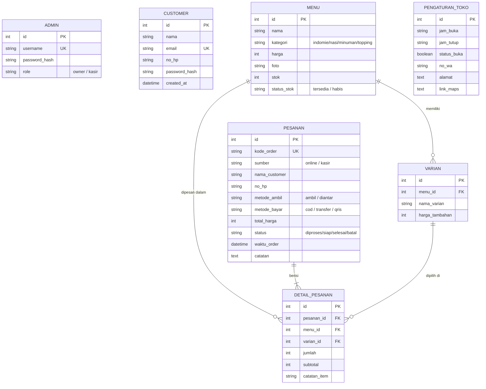
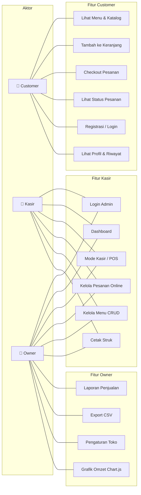
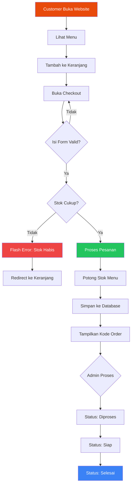

# 🍜 WARMINDO — Sistem Pemesanan Online Warung Mie Instan

Aplikasi web pemesanan makanan untuk Warung Mie Instan (Warmindo) yang mencakup **pemesanan online oleh customer**, **sistem POS kasir**, dan **panel admin** untuk pengelolaan toko secara menyeluruh.

## 📸 Fitur Utama

### 🛒 Fitur Customer (Pelanggan)
- Landing page dengan informasi toko & menu favorit
- Katalog menu lengkap dengan filter kategori (Indomie, Nasi, Minuman, Topping)
- Keranjang belanja dengan pengelolaan item
- Checkout dengan pilihan metode pengambilan (Ambil/Diantar) & pembayaran (COD/Transfer/QRIS)
- Halaman status pesanan real-time dengan kode order unik
- Registrasi & login akun pelanggan
- Profil pelanggan dengan riwayat pesanan

### 🏪 Fitur Admin / Kasir
- **Dashboard** — Ringkasan omzet harian, pesanan masuk, grafik omzet 7 hari (Chart.js)
- **Kasir / POS** — Mode point-of-sale untuk transaksi walk-in langsung
- **Pesanan Online** — Manajemen pesanan dari customer online (diproses → siap → selesai)
- **Kelola Menu** — CRUD menu lengkap dengan upload foto (maks 2 MB), manajemen stok & varian
- **Laporan Penjualan** — Statistik omzet dengan filter periode (Hari/Minggu/Bulan/Custom) + **Export CSV**
- **Pengaturan Toko** — Jam operasional, status buka/tutup, kontak WhatsApp, alamat & Google Maps

### 🔐 Keamanan & Hak Akses
- Password di-hash menggunakan PBKDF2 via `werkzeug.security`
- **Role-based access control**: Admin dibagi menjadi **Owner** dan **Kasir**
  - 🔑 **Owner**: Akses penuh (Dashboard, Kasir, Pesanan, Menu, Laporan, Pengaturan)
  - 🔑 **Kasir**: Akses terbatas (Dashboard, Kasir, Pesanan, Menu)
- Halaman error custom (404 & 403) agar tidak menampilkan traceback Python
- Validasi stok otomatis saat checkout & kasir

---

## 🛠️ Tech Stack

| Komponen      | Teknologi                                        |
|---------------|--------------------------------------------------|
| **Backend**   | Python 3, Flask 3.x                              |
| **Database**  | SQLite (via SQLAlchemy ORM — database-agnostic)   |
| **Frontend**  | HTML5, Tailwind CSS (CDN), JavaScript             |
| **Grafik**    | Chart.js 4.x (CDN)                               |
| **Auth**      | Flask-Login (Admin), Session-based (Customer)     |
| **Font**      | Plus Jakarta Sans (Google Fonts)                  |

---

## 📦 Petunjuk Instalasi

### Prasyarat
- **Python** 3.10 atau lebih baru
- **pip** (biasanya sudah termasuk dengan Python)
- **Git** (untuk cloning repository)

### Langkah-langkah

```bash
# 1. Clone repository
git clone https://github.com/<username>/WEBSITE-WARMINDO.git
cd WEBSITE-WARMINDO-main

# 2. Buat virtual environment
python -m venv venv

# 3. Aktifkan virtual environment
# Windows:
venv\Scripts\activate
# macOS/Linux:
source venv/bin/activate

# 4. Install dependency
pip install -r requirements.txt

# 5. Jalankan aplikasi
python app.py
```

Aplikasi akan berjalan di **http://localhost:5000**

### 🔑 Akun Default

| Role    | Username | Password   |
|---------|----------|------------|
| Owner   | `admin`  | `admin123` |

> **Catatan**: Database SQLite (`instance/database.db`) akan dibuat otomatis saat pertama kali menjalankan `python app.py`. Data awal (menu, admin, pengaturan toko) akan di-seed secara otomatis.

---

## 📁 Struktur Direktori

```
WEBSITE-WARMINDO-main/
├── app.py                  # Entry point aplikasi Flask
├── models.py               # Model database (SQLAlchemy ORM)
├── requirements.txt        # Daftar dependency Python
├── migrate_db.py           # Script migrasi database
│
├── routes/
│   ├── customer.py         # Route untuk halaman customer
│   └── admin.py            # Route untuk panel admin
│
├── templates/
│   ├── base.html           # Template dasar (layout utama)
│   ├── customer/           # Template halaman customer
│   │   ├── index.html      # Landing page
│   │   ├── menu.html       # Katalog menu
│   │   ├── keranjang.html  # Keranjang belanja
│   │   ├── checkout.html   # Halaman checkout
│   │   ├── status_pesanan.html  # Status pesanan
│   │   ├── masuk.html      # Login customer
│   │   ├── daftar.html     # Registrasi customer
│   │   ├── profil.html     # Profil customer
│   │   ├── navbar.html     # Navigasi customer
│   │   └── footer.html     # Footer customer
│   ├── admin/              # Template panel admin
│   │   ├── dashboard.html  # Dashboard + grafik Chart.js
│   │   ├── kasir.html      # Mode POS kasir
│   │   ├── pesanan.html    # Manajemen pesanan online
│   │   ├── menu.html       # CRUD menu
│   │   ├── laporan.html    # Laporan penjualan
│   │   ├── pengaturan.html # Pengaturan toko
│   │   ├── sidebar.html    # Sidebar navigasi admin
│   │   └── login.html      # Login admin
│   └── errors/             # Halaman error custom
│       ├── 404.html        # Halaman Not Found
│       └── 403.html        # Halaman Forbidden
│
└── static/
    ├── css/main.css        # Stylesheet utama
    ├── js/main.js          # JavaScript global (toast, cart, modal)
    └── img/                # Gambar (menu, toko)
```

---

## 🗄️ Entity Relationship Diagram (ERD)

Aplikasi menggunakan **7 tabel** dalam database SQLite:



---

## 👥 Use Case Diagram



---

## 🔄 Flowchart Alur Pemesanan



---

## 📝 Catatan Pengembangan

- **Database-agnostic**: Menggunakan SQLAlchemy ORM. Untuk migrasi ke MySQL/PostgreSQL, cukup ubah `SQLALCHEMY_DATABASE_URI` di `app.py`.
- **Responsive Design**: Semua halaman mendukung desktop dan mobile.
- **Validasi Berlapis**: Validasi dilakukan di frontend (HTML5 + JavaScript) dan backend (Python/Flask).

---

## 📄 Lisensi

Proyek ini dibuat untuk keperluan akademis — Mata Kuliah MPTI, Semester 6.

© 2025 WARMINDO
